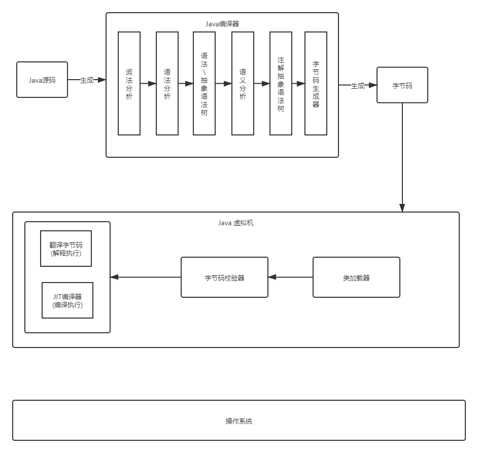

# Java代码执行流程

## 执行流程图示

## JVM的架构模型

Java编译器输入的指令流基本上是一种**基于栈的指令集架构**，另一种是**基于寄存器的指令集架构**

- 基于栈式架构的特点
  - 设计和实现更加单，适用于资源受限的系统
  - 避开了寄存器的分配难题，使用零地址指令方式分配
  - 指令流中的指令大部分是零地址指令，其执行过程依赖于操作栈，指令集更小，编译器容易实现
  - 不需要硬件支持，可移植性好，更好实现跨平台
- 基于寄存器架构的特点
  - 典型的应用是`X86` 的二进制指令集，如传统的PC以及Android的Davlik虚拟机
  - 指令集架构则完全依赖硬件，可移植性差
  - 性能优秀，执行更高效
  - 花费更好的指令去完成一项操作
  - 在大部分请开下，基于寄存器架构的指令集玩玩都以一地址指令、二地址指令和三地址指令为主，而基于栈式架构的指令集却是以零地址指令为主

由于跨平台性的设计，Java的指令都是根据栈来设计的，不同平台CPU架构不同，所以不能设计为基于寄存器的，优点是跨平台，指令集小，编译容易实现，缺点是性能下降，实现同样的功能需要更多的指令

# JVM的生命周期

## 虚拟机的启动

Java虚拟机的启动是通过引导类加载器(bootstrap class loader)创建一个初始类(initial class)来完成的，这个类是由虚拟机的具体实现指定的

## 虚拟机的执行

- 一个运行中的Java虚拟机有着一个清晰的任务：执行Java程序
- 程序开始执行时才运行，程序结束时就停止
- 执行一个所谓的Java程序的时候，真正执行的是一个叫Java虚拟机的进程

## 虚拟机的退出

- 程序的正常执行结束
- 程序在执行过程中遇到了一场或错误而异常终止
- 由于操作系统出现错误而导致Java虚拟机进程终止
- 某线程调用`Runtime`类或`System`类的`exit`方法，或`Runtime`类的`halt`方法，并且Java安全管理器也允许这次`exit`或`halt`操作
- `JNI`(`Java Native Interface`) 规范描述了用`JNI Invocation API`来加载或卸载`Java`虚拟机时，`Java`虚拟机退出情况