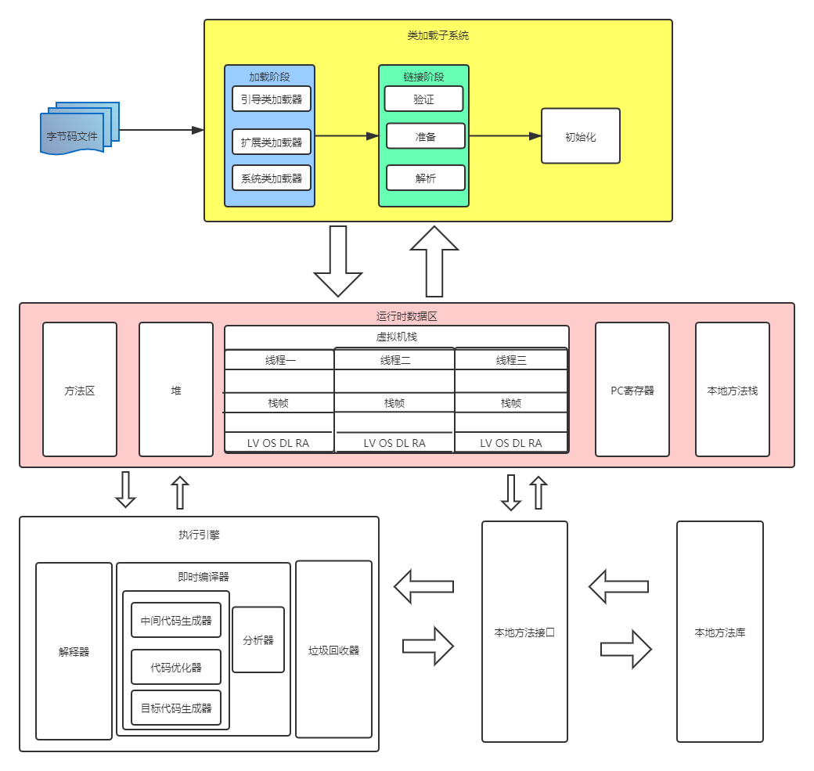

# JVM内存结构

## 内存结构简图

- HotSpot VM 是目前市面上高性能虚拟机的代表作之一
- 采用解释器和即时编译器并存的架构
- 目前Java程序的性能早已脱胎换骨，已经达到可以和C/C++程序一较高下的地步     

## 详细图解

## 类加载子系统

### 作用

- 类加载子系统负责从文件系统或者网络中加载class文件，class文件在文件开头有特定的文件标识
- ClassLoader只负责class文件的加载，至于 它是否可以运行，则由`Execution Engine`决定
- 加载的类信息存放于一块称为方法去的内存空间。除了类的信息外，方法区中还会存放运行时常量池信息，可能还包括字符串字面量和数字常量(这部分常量信息是Class文件中常量池部分的内存映射)