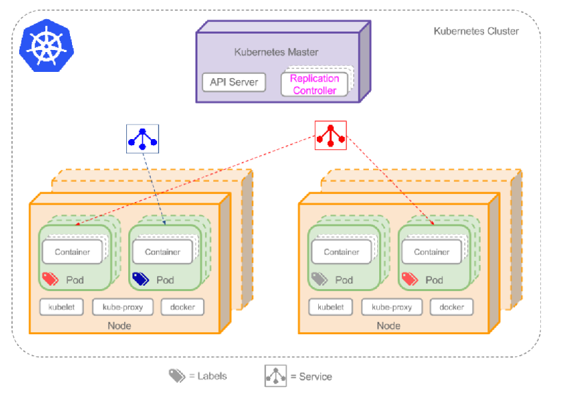

# Kubernetes

##  Kubernetes 的特点

- 自动化容器的部署和复制
- 随时扩展或收缩容器规模
- 容器分组Group,并且提供荣期间的负载均衡
- 实时监控，即时故障发现，自动替换

## 基本概念



## 环境准备

1. 设置主机名与时区

    ```bash
    timedatectl set-timezone Asia/Shanghai
    hostnamectl set-hostname k8s01
    hostnamectl set-hostname k8s02
    hostnamectl set-hostname k8s03
    ```

2. 设置hosts

   ```bash
   vim /etc/hosts
   
   192.168.0.31    k8s01
   192.168.0.32    k8s02
   192.168.0.33    k8s03
   ```


3. 关闭`selinux`

   ```bash
   sed -i 's/SELINUX=enforcing/SELINUX=disabled/g' /etc/selinux/config
   setenforce 0
```
   
4. 关闭防火墙

   ```bash
   systemctl stop firewalld
   systemctl disable firewalld
   ```

   