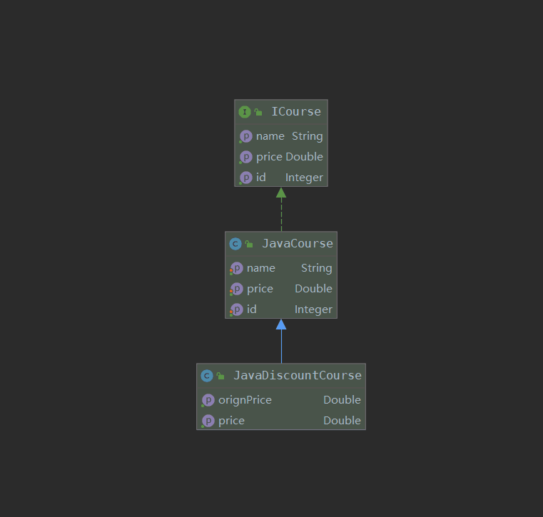

## 开闭原则

**对扩展开放，对修改关闭**

强调用抽象构建框架，用实现扩展细节，从而提高软件的可复用性和可维护性

> 开闭原则的核心思想就是 **面向抽象编程**

- 课程接口
```java
public interface ICourse {

    Integer getId();

    String getName();
    
    Double getPrice();
}
```

- Java课程类

```java
public class JavaCourse implements ICourse {

    private Integer id;

    private String name;

    private Double price;

    @Override
    public Integer getId() {
        return id;
    }
    public void setId(Integer id) {
        this.id = id;
    }

    @Override
    public String getName() {
        return name;
    }
    public void setName(String name) {
        this.name = name;
    }
    @Override
    public Double getPrice() {
        return price;
    }
    public void setPrice(Double price) {
        this.price = price;
    }
}
```
- 有优惠的java课程
```java
public class JavaDiscountCourse extends JavaCourse {

    public Double getOrignPrice(){
        return super.getPrice();
    }

    public Double getPrice(){
        return super.getPrice() * 0.5;
    }
}
```

使用继承的方式，在不改变源代码的前提下，实现了价格优惠的功能！

